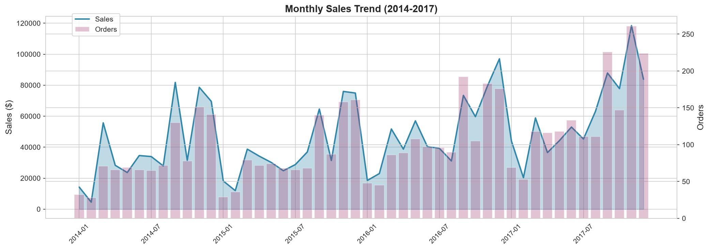
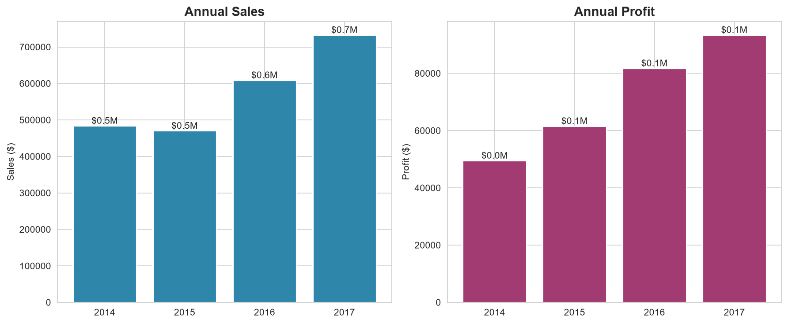
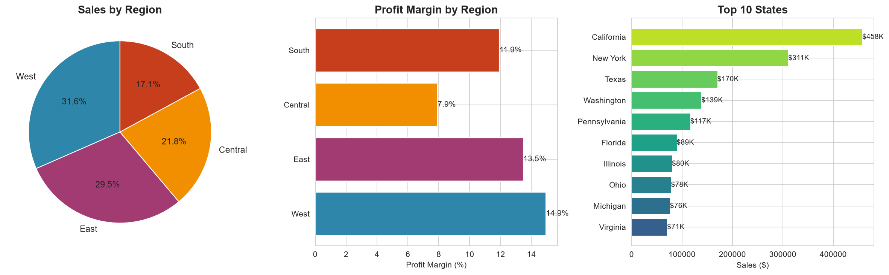
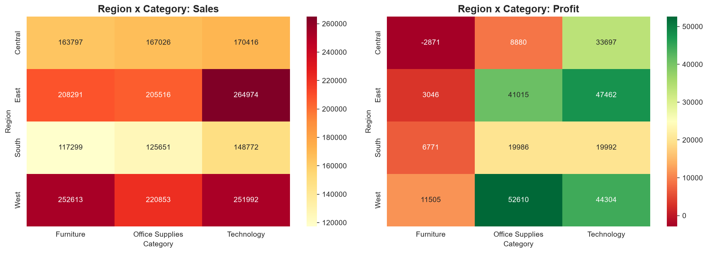
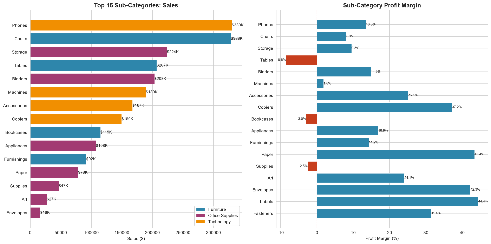
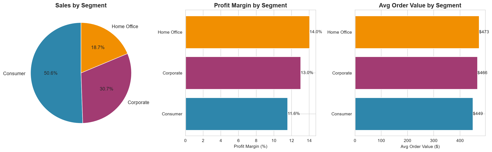
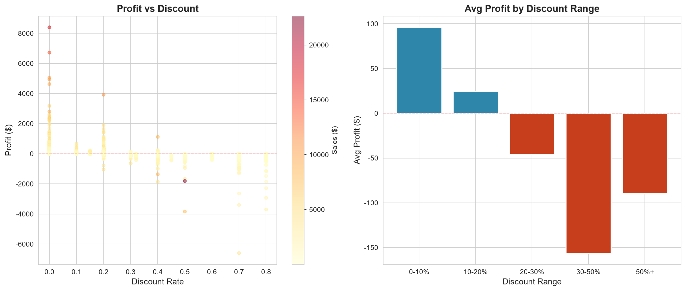
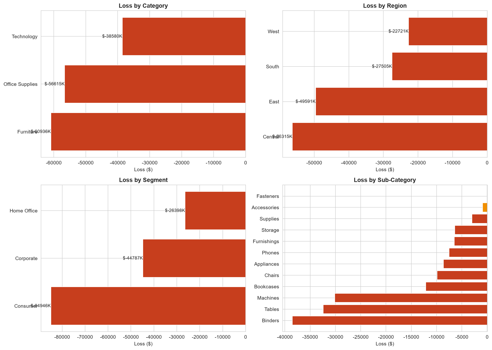

# 🎯 销售雷达 - Superstore 数据分析项目

一个完整的零售销售数据分析项目，包含数据清洗、探索性分析和交互式仪表盘。

## 📊 项目概览

| 指标 | 数值 |
|------|------|
| 数据量 | 9,994 行 × 21 列 |
| 时间范围 | 2014-01-03 ~ 2017-12-30 |
| 总销售额 | $2,297,201 |
| 总利润 | $286,397 |
| 利润率 | 12.47% |

## 📁 项目结构

```
superstore-sales-analysis/
├── data/
│   ├── raw/                    # 原始数据
│   │   └── Sample-Superstore.csv
│   └── processed/              # 清洗后数据
│       └── superstore_cleaned.csv
├── notebooks/                  # Jupyter 分析笔记
│   ├── 01_销售趋势分析.ipynb
│   ├── 02_区域分析.ipynb
│   ├── 03_品类分析.ipynb
│   ├── 04_客户分析.ipynb
│   └── 05_深度洞察.ipynb
├── src/                        # 工程化代码
│   ├── app.py                  # Streamlit 仪表盘
│   ├── data/clean_data.py      # 数据清洗
│   ├── analysis/               # 分析函数模块
│   ├── visualization/          # 可视化工具
│   ├── utils/                  # 通用工具
│   └── run_analysis.py         # 分析模块入口
├── output/                     # 图表输出
│   └── images/                 # 8 张关键图表
├── reports/                    # 分析报告
│   └── report.md
├── main.py                     # 项目入口
├── start.bat                   # 启动脚本（Windows）
├── requirements.txt            # Python 依赖
└── README.md
```

## 🚀 快速开始

### 环境要求

- Python 3.12+
- pip

### 安装步骤

1. **克隆项目**
   ```bash
   git clone https://github.com/shang3000/superstore-sales-analysis#-license
   cd superstore-sales-analysis
   ```

2. **创建虚拟环境**
   ```bash
   python -m venv .venv
   ```

3. **激活虚拟环境**
   ```bash
   # Windows
   .venv\Scripts\activate

   # Mac/Linux
   source .venv/bin/activate
   ```

4. **安装依赖**
   ```bash
   pip install -r requirements.txt
   ```

5. **启动仪表盘**
   ```bash
   # Windows - 双击 start.bat
   # 或命令行
   streamlit run src/app.py
   
   # 或统一入口
   python main.py dashboard
   ```

## 🎛️ 常用命令

```bash
python main.py clean        # 数据清洗
python main.py export       # 导出关键图表
python main.py analysis     # 运行分析模块
python main.py dashboard    # 启动仪表盘
python main.py all          # 完整流程（清洗 + 仪表盘）
```

6. **访问**
   打开浏览器访问 http://localhost:8501

## 📈 关键可视化

### 销售趋势
整体销售额呈逐年上升趋势，第四季度季节性峰值明显。





### 区域与品类
西部区域销售额最高，Technology 利润率最高，Furniture 利润贡献最弱。







### 客户与折扣
Consumer 占比过半但利润率最低；折扣一旦超过 30%，平均利润会跌入负区间。





### 亏损维度
Binders、Tables、Machines 是最主要的亏损子品类；Central 和 East 区域亏损额较大。



## 📈 分析模块

### 01 销售趋势分析
- 月度/季度/年度销售趋势
- 季节性分析
- 同比环比增长

### 02 区域分析
- 全国销售地图
- Top 10 州/城市排名
- 区域利润率对比

### 03 品类分析
- 产品类别占比
- 子类别利润贡献
- 盈利/亏损产品识别

### 04 客户分析
- 客户分层（Consumer/Corporate/Home Office）
- RFM 模型分析
- 客户价值评估

### 05 深度洞察
- 折扣与利润相关性
- 异常值检测
- 关键业务发现

## 🎨 仪表盘特性

- **交互式筛选器**：日期范围、区域、品类、客户类型
- **实时更新**：选择筛选条件后图表自动刷新
- **数据下载**：支持下载筛选后的数据
- **响应式设计**：适配不同屏幕尺寸

## 🔍 关键发现

1. **区域表现**：西部区域最佳（31.6% 份额，14.9% 利润率）
2. **品类差异**：Technology 利润率最高（17.4%），Furniture 最低（2.5%）
3. **折扣陷阱**：折扣超过 30% 会导致亏损
4. **客户结构**：Consumer 占比 50.6%，但利润率最低

## 🛠️ 技术栈

- **数据处理**：Pandas, NumPy
- **可视化**：Plotly, Matplotlib, Seaborn
- **仪表盘**：Streamlit
- **分析环境**：Jupyter Notebook

## 📊 分析入口

除了 notebook 外，也可以通过 `src/run_analysis.py` 或 `python main.py analysis` 直接运行工程化分析模块，快速查看所有核心指标。

## 📝 License

MIT License


⭐ 如果这个项目对你有帮助，请给个 Star！
